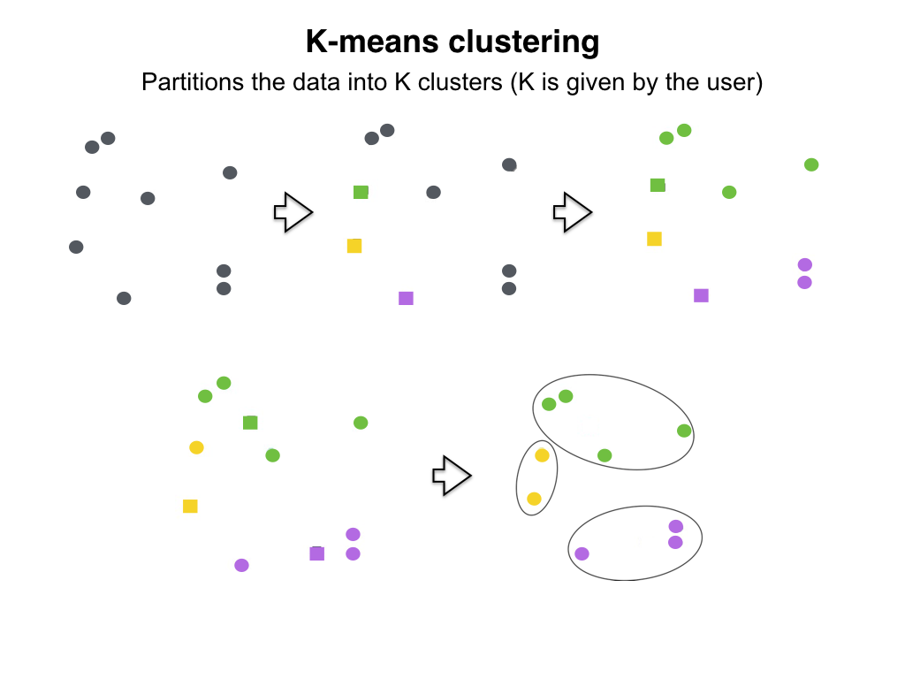
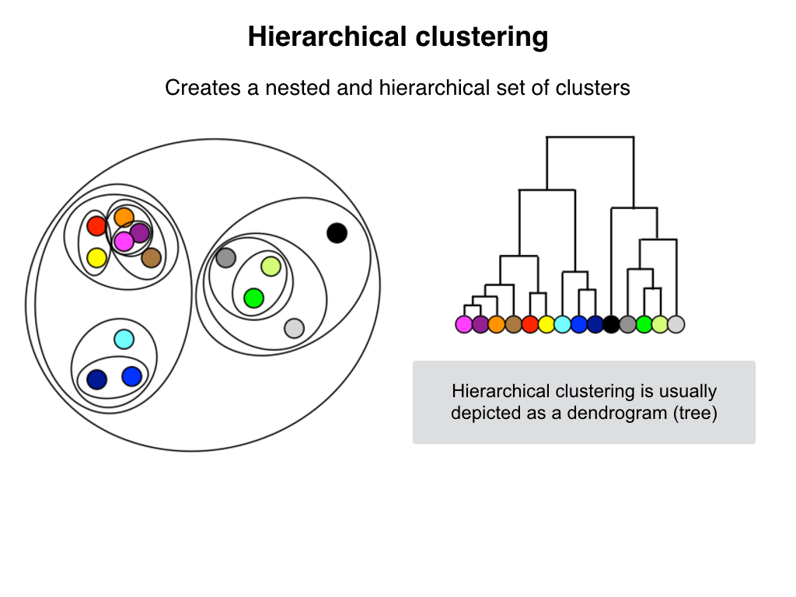
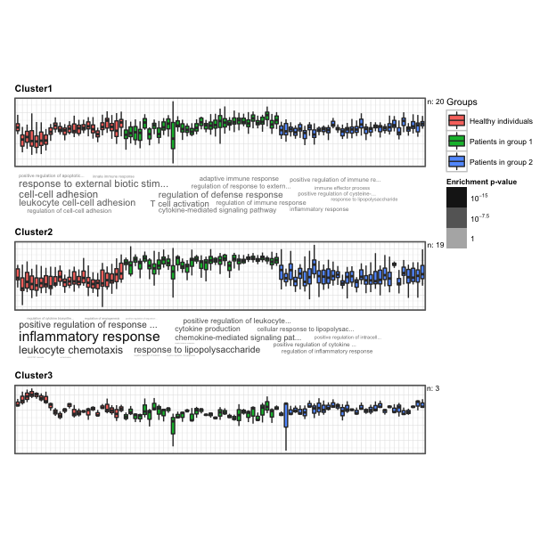
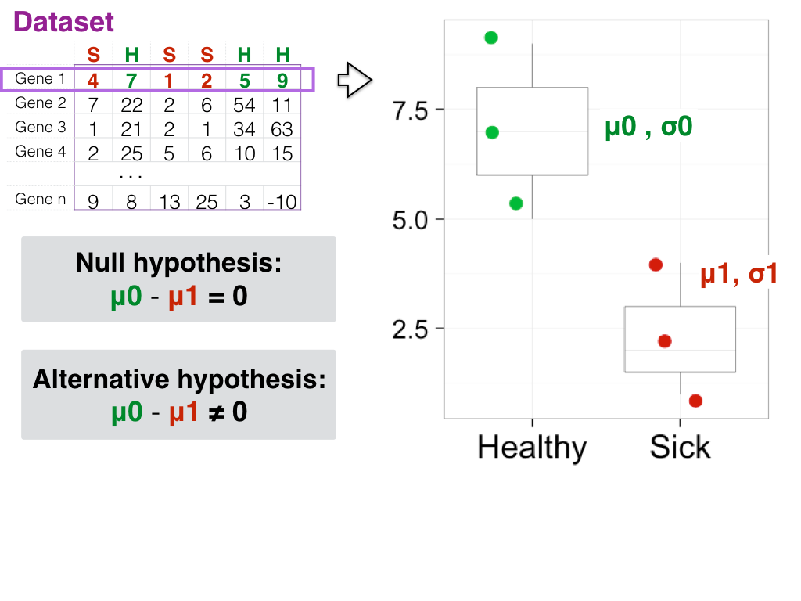

---
title: "Analysing gene expression data"
author: "Elena Sugis"
date: "28 September 2016"
output: pdf_document
minutes: 80
---


> ## Learning Objectives
>
> * apply clustering techniques
> * characterise the results 
> * perform t-test
> * visualise results


# Before we start
Lots of specific R packages for the analysis of the biological data can be obtained from
resource called Biocinductor https://www.bioconductor.org/
Bioconductor provides tools for the analysis and comprehension of biological data.
Bioconductor uses the R statistical programming language, and is open source and open development.

Get the latest version of Bioconductor by starting R and entering the commands:

```{r}
# source("http://bioconductor.org/biocLite.R")
# biocLite()
```

We will use biocLite() to download the specific packages from bioconductor.
Additional help on installing the packages via Bioconductor you can find here http://www.bioconductor.org/install/

Check in which folder you are now and set the working directory using function `getwd()`.
Set your working directory.

```{r, eval = FALSE}
# Set your woking directory
setwd("MyWorkingDirectory")

```

```{r, eval = TRUE, echo = FALSE}
# Set your woking directory
setwd("/Users/nikolaeva/Documents/Dropbox/MILAN_IFOM")
```


# Getting the data

Let's first of all download our data.
Go to the link and download .txt file.

```{r, eval = FALSE, purl = TRUE}
# Download file
download.file("https://s3-eu-west-1.amazonaws.com/pfigshare-u-files/6067029/data_preprocessed.csv", "data/data_preprocessed.csv")
```


After we have downloaded the data, let's read it into the object data_raw.

Read it into the object data_raw.
Parameter row.names = 1 identifies that first column in the csv file is read as row names.

```{r}
data <- read.table(file = "data/data_preprocessed.csv", sep = ";", header = TRUE, row.names = 1)
```

# Meet your data

In this lesson we will use the data of gene expression measured in skin biopsy of healthy and sick people.
The expression of 42 genes is measured in 24 healthy individuals and 35 patients. The biopsy samples from patients
were taken from lesional and nonlesional skin regions. These samples are divided into two groups PG1, PG2.
Few samples were omitted from the study due to their bad quality. 
The final dataset is a matrix of size 42x88.


Functions `head()` and `str()` and `summary()` can be useful to check the
content and the structure of an R object.

* Summary:
   * `str()` - structure of the object and information about the class, length and
	content of  each column
   * `summary()` - summary statistics for each column

Additionally you can check the following oprions:

* Size:
    * `dim()` - returns a vector with the number of rows in the first element, and
	  the number of columns as the second element (the __dim__ensions of the object)
    * `nrow()` - returns the number of rows
    * `ncol()` - returns the number of columns
* Content:
    * `head()` - shows the first 6 rows
    * `tail()` - shows the last 6 rows
* Names:
    * `names()` - returns the column names (synonym of `colnames()` for `data.frame`
	objects)
    * `rownames()` - returns the row names


Note: most of these functions are "generic", they can be used on other types of
objects.

So let's see what is inside our data.

```{r, eval=FALSE}
head(data)
str(data)
summary(data)
```

# Plot the data
One good way of getting the first impression of how your data looks like is to visualize it.
Heatmaps are great to get a general idea of the dataset that you are working with. 
This type of visualization is well implemented in the package `pheatmap`.
Install and attach this package by typing in the following commands: 

```{r}
# install.packages("pheatmap")
library("pheatmap")
```

Now you can use the function `pheatmap()`. Use `?pheatmap()` to get more information about the arguments.
Inspect the argument options that this function has.
Now we are ready to create our first hetmap.

```{r}
pheatmap(data,
         cluster_rows = FALSE,
         cluster_cols = FALSE,
         scale = "none", 
         main="Gene expression in healthy, lesional and nonlesional skin")
```

## Challenge 1
Using the help option change the fontsize on the figure.

```{r first_challenge, echo = FALSE}
# Answer
pheatmap(data,
         cluster_rows = FALSE,
         cluster_cols = FALSE,
         scale = "none",
         fontsize_col = 6,
         fontsize_row = 6,
         main="Gene expression in healthy, lesional and nonlesional skin")
```

# Cluster your data
In biology quite often similar things act in a similar way. As we study gene expression, we might be potentially interested in capturing genes that behave in similar fashion. In order to find potentially interesting groups of genes, we would perform a cluster analysis. 

We will see how to apply two clustering methods that are very popular in bioinformatics: `kmeans` and `hierarchical` clustering. Let's start with `kmeans`.



In order to work with `kmeans` clustering, one has to choose an appropriate number of clusters,that we want to find in the data. To estimate the number of clusters, Elbow method/plot is used (check https://en.wikipedia.org/wiki/Determining_the_number_of_clusters_in_a_data_set). 
k-means minimize the within group variance and maximize the between-group variance.
The Elbow method looks at the variance explained as a function of the number of clusters.
Here is a code that generates an Elbow plot.

```{r, echo=TRUE, eval = FALSE}
# Calculate the sum of squared distances from cluster members to 
# centers for ten possible number of clusters
wss <- sapply(1:10, function(x) sum(kmeans(data, centers=x)$withinss))

# Visualise the sum of the squared distances from cluster 
# members to centers for all ten possible number of clusters 
plot(1:10, wss, type="b", xlab="Number of Clusters",
     ylab="Within groups sum of squares", main = 'Elbow plot') 
```

Choose number of clusters `k` by looking at the Elbow plot you have just created. Remind
yourselves that an appropriate number of clusters is the number at which the reduction in SSE decreases dramatically. This produces a bending point in the Elbow plot.

```{r}
# Select more meaningful k by looking at Elbow plot 
k <- 4 

# Enable reproducibility
set.seed(1234)

# Run kmeans (check lecture slides) clustering to find clusters in our data
km <- kmeans(x = data, centers = k)
```

```{r, eval = FALSE}
# Explore the structure of clustering
head(km)
```

```{r}
# Plot heatmap
pheatmap(data.frame(km$centers), labels_row = km$size, 
         cluster_rows=F, cluster_cols=F,
         border_color = "grey60",
         main="Clustered gene expression")

```


## Hierarchical clustering



```{r}
# Attach the package
library(amap)

# Perform hierarchical clustering 
hc.data <-  hcluster(data)

# Visualize the result as dendrogram
plot(hc.data)

# Split into 3 clusters
ct <- cutree(hc.data, k=3)

# Sort the clusters
sort(ct)

# Save the clustering results as RData
save(ct, hc.data, file = "results/hc.RData")
```


# Extract knowledge

## Gene Ontology cluster annotations

After you have identified the clusters, you can characterise the genes that are located in each of them.
We can identify the biological processed that they are involved in using package `GOsummaries`
or using a web-tool gProfiler http://biit.cs.ut.ee/gprofiler/.

```{r,eval=FALSE}
# Get gene names in each of the cluster
g1 <- as.character(names(sort(ct[ct == 1])))
g2 <- as.character(names(sort(ct[ct == 2])))
g3 <- as.character(names(sort(ct[ct == 3])))

# Save the first gene list as txt file
write.table(g1, file = "results/genelist_1.txt", sep = "\t", row.names = F, col.names = F, quote = F)

# Attach package
library(GOsummaries)

# Create a list of gene lists for the functional enrichment analysis
gl <- list(Cluster1 = g1, Cluster2 = g2, Cluster3 = g3)

# Find the terms and their significance
gs <- gosummaries(gl)

# Visualize the results
plot(gs, fontsize = 8)

# Create samples' annotation
Groups <- colnames(data)
Groups <- gsub("H.*", "Healthy individuals", Groups)
Groups <- gsub("PG1.*", "Patients in group 1", Groups)
Groups <- gsub("PG2.*", "Patients in group 2", Groups)
my_annotation <- cbind(Groups, Groups)
rownames(my_annotation) <- colnames(data)

# Convert to data.frame type
my_annotation <- as.data.frame(my_annotation[, 1])

# Remane colums
colnames(my_annotation) <- "Groups"

# Add expression
gs_exp <- add_expression.gosummaries(gs, exp = data,
                                    annotation = my_annotation)

# Plot functional enrichment analysis results together with gene expression
plot(gs_exp, fontsize = 8, classes = "Groups")

```
Visualization of the functional enrichment analysis results of the selected clusters:


# Differential expression analysis 

The idea of differential expression analysis is to select the genes that separate two conditions the most.

One way how to find differentially expressed genes is by applying t-test.
We use this statistical test to compare our sample populations and determine if there is a significant difference between their means.
In  assumes that both samples come from normally distributed population with not equal variances.


## How to make t-test in R
Let's compare 2 groups from our data- patients in group1 and healthy people.

```{r}
# Attach library dplyr
library(dplyr)

# Select the colums' indices for the patients group 1 and healthy controls
cases <- grep("PG1.*",colnames(data))
controls <- grep("H.*",colnames(data))

# T-test for one row(gene)
ttest_1g <- t.test(data[1,cases],data[1,controls])

# Structure of the output
str(ttest_1g)

# Extract p-value from the resulting data structure
ttest_1g$p.value
  
# Calculate t-test results for all genes.
# Apply t-test using `apply()` loop over rows. Select only p-value from the output.
ttest_res <- apply(data, 1, function(x) t.test(x[cases],x[controls])$p.value)

# Convert output to data frame
ttest_res <- data.frame(ttest_res)
colnames(ttest_res) <- "pval"

# Add rownames as column
ttest_res <- cbind(gene = rownames(ttest_res), ttest_res)

# Keep genes with p-value <= 0.05
diff_genes <- ttest_res %>%
  filter(pval <= 0.05) %>%
  arrange(pval)  

# Save the results
write.table(diff_genes, file = "results/diffexp_genes.txt", sep = "\t", row.names = F, col.names = F, quote = F)

# Extract gene names
dfg_names <- as.character(diff_genes[,1])

```

# Boxplot

When we have selected differentially expressed genes, we can now plot boxplots of gene expression in theese genes.

Let's select a part of our data related to differentially expressed genes.
To do so we would need to select the corresponding rows from data.


```{r}
data_diffexp <- data[rownames(data)%in%dfg_names,] 

```

For that we will modify our dataframe a bit using function `gather()` from the package `tidyr`.
Install and attach the package as following:

```{r}
# install.packages("tidyr")
library("tidyr")
```

`tidyr` syntaxis is very similar to `dplyr` package.
You can use the pipe operator to send the output of the previous command onwards.

There are four fundamental functions of data tidying:

 * `gather()` takes multiple columns, and gathers them into key-value pairs: it makes “wide” data longer
 * `spread()` takes two columns (key & value) and spreads in to multiple columns, it makes “long” data wider
 * `separate()` splits a single column into multiple columns
 * `unite()` combines multiple columns into a single column

We will reshape our object into a form suitable for easy plotting using function `gather()`.
You can specify the columns that will be converted to long format, or specify the ones you want to remain in the new data frame by prefixing them with '-'. 

Let's create a function that adds the type of our samples (H, PG1, PG2) to the data and converts it to long format.
```{r}

  # Transpose
  dt <- t(data_diffexp)
  
  # Convert to data.frame
  dt <- as.data.frame(dt)
  
  # Bind the column with sample names
  dt <- cbind(dt, sample = rownames(dt))
  
  # Change the type of the column
  dt$sample <- as.character(dt$sample)
  
  # Remove sample number 
  dt$sample <- gsub("0.*", "", dt$sample)
  
  # Transform to long format
  data_melt <- dt %>% 
  gather(variable, value, - sample)
  
  # Change the names of the columns
  colnames(data_melt) <- c("Group", "Gene", "Expression")


# Show the head of newly obtained variable
head(data_melt)
```


# Boxplots

You can data by looking at the boxplots.
In case you decided to filter out outliers interquartile rate can be applied as a filtering criterion.

```{r}
# Attach library ggplot2
library(ggplot2)

# Draw boxplots
ggplot(data_melt, aes(x = Group, y = Expression))+
  # Plot for each gene in the separate facet
  facet_wrap(~ Gene, scales = "free_y")+
  # Add white background
  theme_bw()+
  theme_bw(base_size = 6)+
  geom_boxplot(outlier.shape = NA, fatten = 0.2, lwd = 0.2)+
  geom_jitter(width = .7, size = 0.01,aes(colour = Group))+
  # Manually assign colors to the groups
  scale_color_manual(values = c("#00ba38", "#d4170a", "#00ebf2"))+
  theme(text = element_text(size = 6),
        axis.text.x = element_text(size = 6),
        legend.text = element_text(size = 6),
        axis.title.x = element_blank(), axis.title.y = element_blank()
        ) 
```


